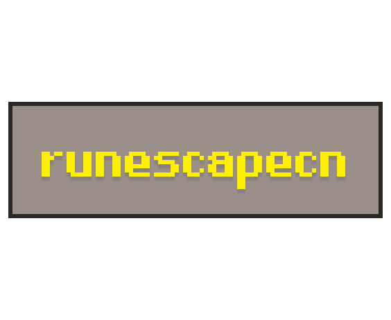

# runescapecn/ui



Old School RuneScape-themed UI component library built on [shadcn/ui](https://ui.shadcn.com) patterns. Pixel-perfect borders, authentic OSRS fonts, beveled 3D shadows, and the classic Gielinor dark aesthetic.

## Stack

- **React 19** + **TypeScript**
- **Tailwind CSS v4** (CSS-first config, no `tailwind.config.js`)
- **Radix UI** primitives for accessibility
- **Class Variance Authority** for variant management
- **Vite** for dev server and builds

## Getting Started

```bash
git clone git@github.com:a01410207/runescapecn.git
cd runescapecn
pnpm install
pnpm dev
```

## Commands

```bash
pnpm dev        # Start dev server
pnpm build      # Type check + production build
pnpm lint       # ESLint
pnpm preview    # Preview production build
```

## Components

| Component | Description |
|-----------|-------------|
| **Button** | 6 variants (default, classic, stone, destructive, ghost, link) and 4 sizes |
| **Card** | Container with stone-textured background and sub-components |
| **Dialog** | Modal with dark overlay, stone content panel, and red close button |
| **Select** | Dropdown menu with chevron indicator and green checkmarks |
| **Tabs** | Tabbed interface with gold active state |
| **Input** | Text input with inset border styling |
| **Checkbox** | Toggle with green check indicator |
| **Badge** | Status indicator with 4 color variants |
| **Tooltip** | Hover-activated tooltip with yellow text |
| **Progress** | Progress bar with 3 fill color variants |
| **CopyButton** | Clipboard copy with confirmation feedback |

## Design System

### Colors

| Token | Hex | Usage |
|-------|-----|-------|
| `rs-gold` | `#C9A961` | Primary, titles, accents |
| `rs-orange` | `#FF981F` | Text, hovers, links |
| `rs-brown-dark` | `#1a1a1a` | Page background |
| `rs-brown-medium` | `#2a2a2a` | Mid surfaces |
| `rs-brown-light` | `#7a7a7a` | Muted text, borders |
| `rs-green` | `#00FF00` | Success |
| `rs-red` | `#FF0000` | Destructive |
| `rs-yellow` | `#FFEB3B` | Warnings, tooltips |
| `rs-cyan` | `#00FFFF` | Accent alt |

### Fonts

All fonts are from [RuneStar/fonts](https://github.com/RuneStar/fonts) (CC0-1.0, public domain).

| Variable | Font | Use for |
|----------|------|---------|
| `--font-rs` | RuneScape Plain 12 | Body text |
| `--font-rs-bold` | RuneScape Bold 12 | Buttons, headings |
| `--font-rs-quill` | RuneScape Quill | Decorative descriptions |
| `--font-rs-quill-caps` | RuneScape Quill Caps | Large display titles |

### Styling Rules

- **No rounded corners** &mdash; `border-radius: 0` on everything
- **No smooth transitions** &mdash; `transition-none` on interactive elements
- **Beveled borders** &mdash; inset box-shadows with `rgba(255,255,255,...)` highlights and `rgba(0,0,0,...)` darks
- **All borders** &mdash; `border-2 border-black`
- **Font smoothing disabled** &mdash; `-webkit-font-smoothing: none`
- **Pixelated rendering** &mdash; `image-rendering: pixelated`

## Project Structure

```
src/
  components/ui/      # All UI components
  components/         # Docs supporting components
  docs/               # Component registry and demo files
  layouts/            # Page layouts (docs shell)
  pages/              # Route pages
  lib/utils.ts        # cn() utility
  styles/globals.css  # Tailwind v4 config, fonts, CSS variables
  App.tsx             # Landing page
  main.tsx            # Router entry point
public/fonts/
  otf/                # RuneStar OSRS fonts (OpenType)
  ttf/                # RuneStar OSRS fonts (TrueType)
```

## Use with AI

The docs include a **Copy Markdown** button that copies the full component library documentation to your clipboard. Paste it into ChatGPT, Claude, or any LLM to get help building UIs with runescapecn components.

## Credits

- Fonts: [RuneStar/fonts](https://github.com/RuneStar/fonts) (CC0-1.0)
- Inspired by [shadcn](https://ui.shadcn.com/) by shadcn and [warcraftcn](https://www.warcraftcn.com/) by OrcDev
- Built by [alns0](https://x.com/alns0_)

## License

MIT
